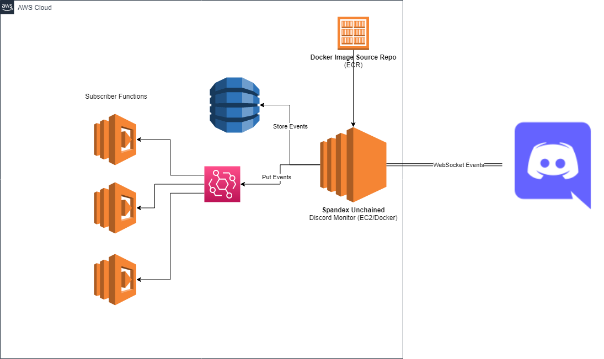

# AWS CDK Infrastructure

The infrastructure portion of the project is meant to build the CDK *Cloudformation* template which gets uploaded to AWS in order to generate the necessary infrastructure for the bot project

## Project Structure
---

The `/src` folder contains all the necessary typescript files to generate the templates. `/bin` contains the top level file which when run generates the template. The `/lib` folder contains all helper files including [Stacks](https://docs.aws.amazon.com/cdk/v2/guide/stacks.html), which are the primary siloing mechanic of code as well as [Constructs](https://docs.aws.amazon.com/cdk/v2/guide/constructs.html) which are more abritrary groupings of like infrastructure

    /src
     | - /docs
     | - /bin
     | - /lib
     | - /cdk.out*

*Note: the `cdk.out` folder will generate when doing a cdk synth or deploy. It is where the AWS CDK puts the completed build artifacts*

## Working Locally

1. Create an IAM User that will be used for local development
   * Give the IAM User `Administrator` Permissions
   * Save off the credentials
2. Install the [AWS CLI](https://docs.aws.amazon.com/cli/latest/userguide/getting-started-install.html). 
3. Use `aws configure` to input the credentials you built in step 1
4. Install the aws-cdk globally to use the CLI tool (npm/yarn global install `aws-cdk`)
5. Create a `cdk.context.json` file in the infra folder with the following format

```js
{
    "botToken": "<Bot Token Here>"
}
```

*or*

You can run `cdk synth` with a `--context` flag to pass in the bot token

6. Now you should be able to run `cdk synth` to test the construction of the CloudFormation templates that correspond to the stacks.

## Generated Infrastructure
---

This project consists of a few key parts

**Spandex Unchained (Discord Bot)**
    
    This static infrastructure will plug into the Discord websocket API and listen for messages that it knows how to respond to. It will then distribute events based on the form and content of those messages

**Event Publisher**

    This piece of infrastructure will provide a Pub/Sub model for any functions that want to consume the standardized event format and react. This may be functions from this project or it may be functions allowed access in other workload accounts.

**Event Handlers**

    Most likely these will be lambdas which will be triggered by the events shipped through eventbridge.


**Event Store**

    A store which will save off all events that get processed by the discord monitor bot


## Architecture

---




## Resources

* [CDK CLI Reference](https://docs.aws.amazon.com/cdk/v2/guide/cli.html)